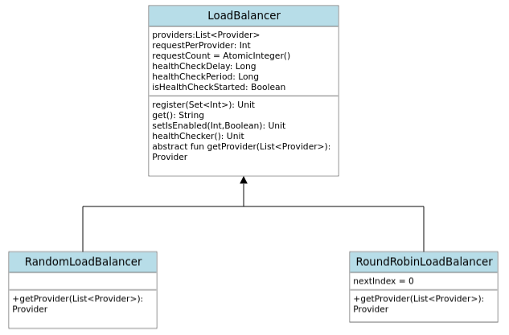

# IptiQAssignment

The application is a simple load balancer implementation.

## Solution

The solution is implemented using Kotlin.

Technologies and tools used

1. Kotlin
2. Gradle

## Implementation

The solution is a simple application implemented using Kotlin and Gradle.

An instance of Loadbalancer is created based on the algorithm type and further action is performed.



Following operations can be performed:

1. Register list of providers from set of ids
   ```
   fun register(providers: Set<Int>): Unit
    Parameters:  
       providers - Set of provider Ids
    Returns: Unit
   ```
2. Retrieves unique identifier of provider
   ```
     fun get(): String
     Returns: String
   ```
3. Retrieves a provider based on random or round-robin algorithm
   ```
     fun getProvider(providers: List<Provider>): Provider
     Parameters:
            providers - List of Provider
     Returns: Provider
   ```
4. Manually enable or disable a provider based on id
   ```
     fun setIsEnabled(id: Int, isEnabled: Boolean): Unit
     Parameters:
            id - Provider id
            isEnabled - true/false
     Returns: Unit
   ```
4. Health check on each provider when they are alive or enabled and enable it only after 2 consecutive success check.

   Once the providers are registered, health check is performed every 1 sec.
   ```
     fun healthChecker(): Unit
     Parameters:
     Returns: Unit
   ```

In case an exception occurs, custom exceptions are thrown.


## Running the project

Pre-requisite
- JDK 18
- Gradle


